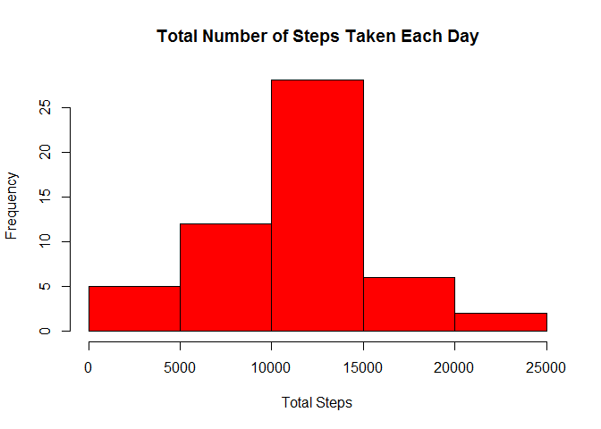
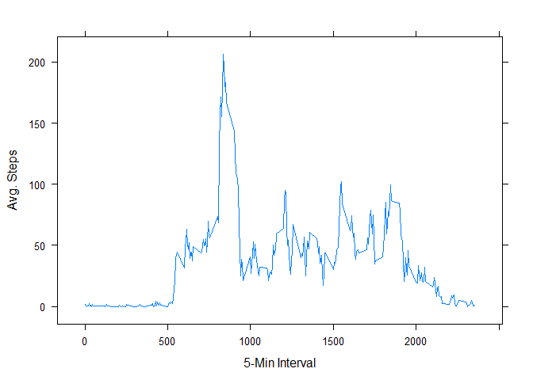
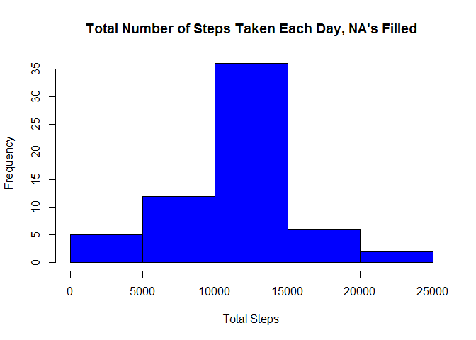

# Reproducible Research: Course Project 1
Robert Osterried  
March 13, 2016  


## Loading and Preprocessing the Data
First, let's load the data (CSV is in the working directory) and take a look . . .

```r
data <- read.csv('activity.csv', na.strings = "NA")
names(data)
```

```
## [1] "steps"    "date"     "interval"
```

```r
head(data)
```

```
##   steps       date interval
## 1    NA 2012-10-01        0
## 2    NA 2012-10-01        5
## 3    NA 2012-10-01       10
## 4    NA 2012-10-01       15
## 5    NA 2012-10-01       20
## 6    NA 2012-10-01       25
```

```r
dim(data)
```

```
## [1] 17568     3
```

## What is Mean Total Number of Steps Taken per Day?
Sum the steps for each day and make a histogram:

```r
totalSteps <- aggregate(data[, 1], list(Date=data$date), sum)
hist(totalSteps$x, main = "Total Number of Steps Taken Each Day", xlab = "Total Steps",
     col = "red")
```



####Mean of total number of steps per day:

```r
mean(totalSteps$x, na.rm = TRUE)
```

```
## [1] 10766.19
```

####Median of total number of steps per day:

```r
median(totalSteps$x, na.rm = TRUE)
```

```
## [1] 10765
```

## What is the Average Daily Activity Pattern?

Average the steps for each five-minute interval across all days and make a time series plot:

```r
intervalSteps <- aggregate(data[, 1], list(Interval=data$interval), mean, na.rm=TRUE)
library(lattice)
xyplot(x ~ Interval, intervalSteps, type = "l", xlab = "5-Min Interval", 
       ylab = "Avg. Steps")
```



Determine which 5-minute interval, on average across all days, has the maximum number of steps:

```r
intervalSteps[intervalSteps$x == max(intervalSteps$x),]$Interval
```

```
## [1] 835
```

## Imputing Missing Values
#### Calculate the total number of missing values in the dataset

```r
sum(is.na(data$steps))
```

```
## [1] 2304
```
#### Devise a strategy for filling in all of the missing values in the dataset.
We will use the mean for any 5-minute interval that is missing a value.

```r
filledData <- data

# I'm not sure how to do this the "R" way, so here's the Java way . . .
for(i in 1:nrow(filledData)) {
    row <- filledData[i,]
    if (is.na(row$steps)) {
        # Find the average value for this 5-minute interval.
        intAvg <- (subset(intervalSteps, Interval == row$interval))$x
        # Assign that average value back into the data frame.
        filledData[i,]$steps <- intAvg
    }
}
```
#### Make a histogram of the total number of steps taken each day.

```r
totalStepsFilled <- aggregate(filledData[, 1], list(Date=filledData$date), sum)
hist(totalStepsFilled$x, main = "Total Number of Steps Taken Each Day, NA's Filled", 
     xlab = "Total Steps", col = "blue")
```



####Mean of total number of steps per day:

```r
mean(totalStepsFilled$x)
```

```
## [1] 10766.19
```

####Median of total number of steps per day:

```r
median(totalStepsFilled$x)
```

```
## [1] 10766.19
```
The mean value here is the same as in the first part of the assignment.

However, the median value is different from that in the first part, and is exactly the same as the mean.

By imputing missing data based on means of other days, we created more days with entries exactly equal to those means, and those days thus occur in the middle of the total steps histogram.

## Are there differences in activity patterns between weekdays and weekends?
Create a new factor variable in the dataset with two levels - "weekday" and "weekend" indicating whether a given date is a weekday or weekend day.

```r
weekDays <- c("Mon","Tue","Wed","Thu","Fri")
filledData$dayType <- 
    ifelse(weekdays(as.POSIXct(filledData$date), abbreviate = TRUE) %in% weekDays ,
           "weekday", "weekend")
```

Average the steps for each five-minute interval for weekdays and weekend days:

```r
intervalStepsFilled <- 
    aggregate(filledData[, 1], list(filledData$interval,filledData$dayType), mean)
```
Make a panel plot containing a time series plot of the 5-minute interval (x-axis) and the average number of steps taken, averaged across all weekday days or weekend days (y-axis).


```r
xyplot(x ~ Group.1|Group.2, intervalStepsFilled, type = "l", 
       xlab = "Interval", ylab = "Number of steps", layout=c(1,2))
```


